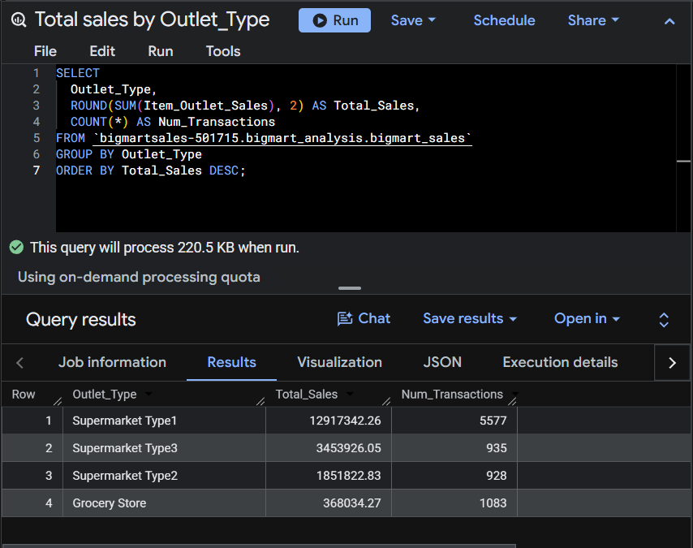
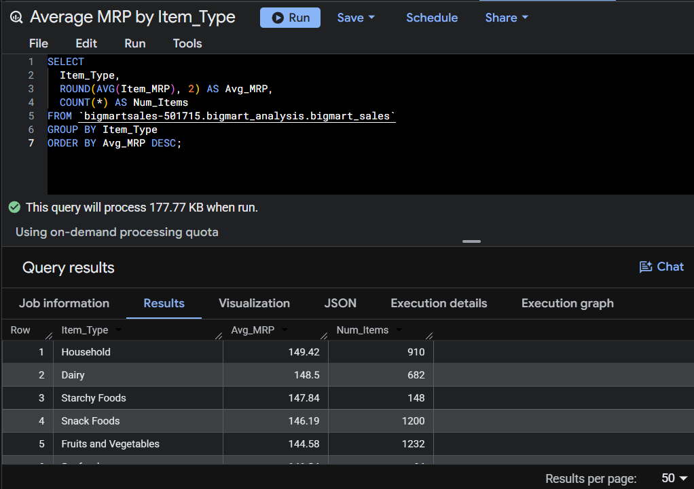
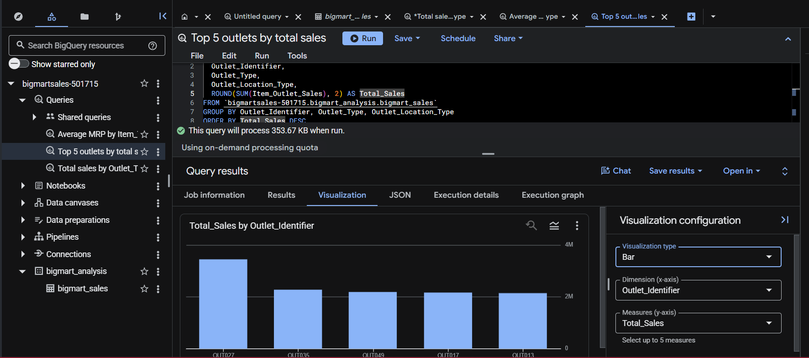

# BigMart Sales Data Pipeline

## Overview
End-to-end data pipeline: raw CSV → Python cleaning → normalized MySQL schema 
→ BigQuery → Looker Studio dashboard. Built to practice data engineering 
fundamentals: ETL, schema design, data quality handling, and cloud-based analytics.

## Dataset
- Source: [BigMart Sales Dataset (Kaggle)](https://www.kaggle.com/datasets/yasserh/bigmartsalesdataset)
- 8,523 rows, 12 columns — 2013 sales data across 10 outlets, 1,559 unique products

## Pipeline Architecture
Raw CSV → Python (Pandas cleaning) → MySQL (staging + normalized schema) 
→ BigQuery (cloud storage + analysis) → Looker Studio (visualization)

## 1. Data Cleaning (Python/Pandas)
- Handled missing `Item_Weight` using hierarchical imputation: item-level mean 
  first, falling back to `Item_Type` group mean only when an item had no 
  known weight at all
- Imputed missing `Outlet_Size` using mode grouped by `Outlet_Type`
- Standardized inconsistent `Item_Fat_Content` labels (e.g., "LF", "low fat" → "Low Fat")
- Treated `Item_Visibility` = 0 as a data error (not a true zero) and imputed 
  using `Item_Type` + `Outlet_Type` group mean

## 2. Schema Design (MySQL)
Designed a normalized schema instead of using the flat CSV structure:
- `products` — one row per item (Item_Identifier as PK)
- `outlets` — one row per store (Outlet_Identifier as PK)
- `sales` — fact table linking items to outlets (many-to-many relationship, 
  since one item is sold across multiple outlets)

**Key design decision:** Initially placed `Item_MRP` in `products`, but data 
validation revealed MRP varies by outlet (regional pricing) — moved it to 
`sales` to correctly reflect it as an item-outlet property, not a pure item property.

**Data quality catch:** Found and fixed an imputation bug where `Item_Weight` 
(a fixed product attribute) was being calculated inconsistently across outlet 
rows for the same item, due to imputation running before deduplication logic 
was in place. Fixed by re-ordering the imputation hierarchy.

## 3. Cloud Analysis (BigQuery)
Loaded cleaned dataset into BigQuery, ran aggregate queries:
- Total sales by outlet type
- Average MRP by item type
- Top 5 outlets by total sales

## 4. Visualization (BigQuery)
Used BigQuery's built-in chart feature to visualize aggregate query results directly:
- Bar chart: total sales by outlet type
- Bar chart: average MRP by item type
- Bar chart: top 5 outlets by total sales

## Tech Stack
Python (Pandas, NumPy) · MySQL · Google BigQuery

## Files in this repo
- `bigmartsales_datacleaning.py` — Pandas cleaning script
- `schema.sql` — CREATE TABLE statements for products/outlets/sales
- `inserts.sql` — staging table load + insert queries
- `bigquery_queries.sql` — aggregate queries run in BigQuery
